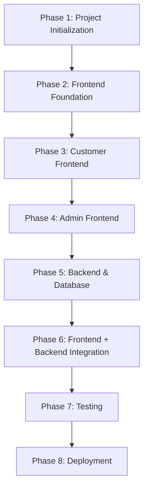
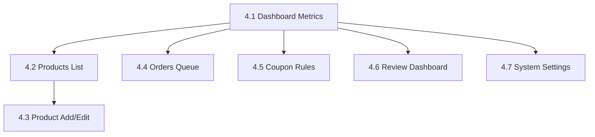

# Implementation Plan: OneBasket Ecommerce App

This document serves as the master engineering plan for **OneBasket**, a hyperlocal, single-vendor ecommerce platform designed for an existing offline retail business in Ahmedabad, Gujarat. 

---

## 1. Project Overview

### Project Objective
To establish a digital sales and tracking channel for the offline retail store in Ahmedabad. The platform enables local customers to register, browse products, manage shopping carts/wishlists, securely checkout using Stripe or Cash on Delivery, track orders in real time, and leave product reviews. It also provides the business owner with a comprehensive Web Admin Portal to manage products, inventory, coupons, and orders.

### V1 MVP Scope
The V1 scope strictly covers P0 features as defined in [PRD.md](file:///Users/nikeshprajapati/Job%20Related/one_basket_ecommerce_app/docs/PRD.md). All P1 and P2 features (such as GPS delivery tracking, return/exchange flows, loyalty programs, push notifications, and multi-admin roles) are excluded. 

Key product constraints for V1:
*   **Hyperlocal Focus:** Service is restricted entirely to Ahmedabad. Shipping address validation will check against a whitelist of valid local pincodes.
*   **Authentication:** Email and password credentials only. No OTP or password recovery options in V1 (password changes are performed only while logged in).
*   **Map Integration:** ❌ Google Maps is NOT used in V1. Addresses are collected via form fields.
*   **Backend:** Supabase Free Tier (PostgreSQL, Storage, Realtime, Auth, Edge Functions).

### Timeline
The project timeline is structured over **12 weeks** from kickoff to production deployment.

### Development Philosophy (Frontend-First)
To minimize risk and prevent shifting data schemas, we employ a strict **Frontend-First** methodology:
1.  **UI Isolation:** The entire client UI (Customer Mobile/Web and Admin Web Portal) is built, styled, and verified using **Mock Data** and local mock repositories before any backend coding begins.
2.  **No Mixed Contexts:** Developer resources are strictly aligned with the current phase. Backend implementation begins only after all frontend screens are complete and approved.
3.  **Simulated State:** Mock repositories will use synthetic network delays to verify loading indicators, skeleton UI blocks, and error handling states.

### Definition of Done (DoD)
A task or feature is considered "Done" when:
*   The code compiles without errors or warnings.
*   `flutter analyze` runs clean with no lint warnings.
*   Unit and widget tests pass, achieving at least 80% coverage for domain logic.
*   The UI matches the neomorphic specifications in [FRONTEND_GUIDELINES.md](file:///Users/nikeshprajapati/Job%20Related/one_basket_ecommerce_app/docs/FRONTEND%20_%20GUIDELINES.md).
*   Row-Level Security (RLS) policies are active and tested on the database layer.
*   Stripe payment transactions are successfully simulated and verified via webhook handlers.
*   Code is merged into the `develop` branch after code review.

### Coding Standards
*   **Architecture:** Clean Architecture pattern splitting layers into:
    *   **Presentation Layer:** Widgets, controllers/Riverpod state providers.
    *   **Domain Layer:** Business models, use cases, and repository interfaces.
    *   **Data Layer:** API datasources, local caching (Shared Preferences), and concrete repository implementations.
*   **Type Safety:** Strict type safety. Avoid `dynamic` types; compile-time schemas generated via `freezed` and `json_serializable` for data mapping.
*   **Styling:** Follow a unified styling architecture utilizing design tokens defined in a central theme class. No ad-hoc spacing or hardcoded colors in widgets.
*   **Naming Conventions:** Dart standard `camelCase` for code elements, `snake_case` for database schemas, and `PascalCase` for widget classes.

### Folder Structure Overview
The project is organized in a feature-first structure under the `lib/` directory:

```
lib/
├── main.dart                       # Entry point (initializes app routing & Supabase)
├── core/                           # Shared core components
│   ├── constants/                  # Asset paths, API endpoints, config values
│   ├── theme/                      # Visual tokens, colors, typography, neomorphic styles
│   ├── routing/                    # GoRouter configuration & route paths
│   ├── network/                    # Supabase Client wrapper
│   ├── widgets/                    # Reusable UI widgets (buttons, input fields, badges)
│   └── utils/                      # Form validations, date formatters, and helpers
└── features/                       # Independent feature modules
    ├── auth/                       # Register, Login, Profile screens (Customer & Admin)
    ├── catalog/                    # Browsing, Search, Filters, Product Details
    ├── cart/                       # Cart lists, quantity adjustments, checkout triggers
    ├── wishlist/                   # Wishlist display and quick action controls
    ├── checkout/                   # Address selection, payment type selection, coupon validation
    ├── orders/                     # Customer order history, tracking steps, cancellation dialogs
    ├── reviews/                    # Rating bars, text reviews list, submission forms
    ├── addresses/                  # Saved address list and CRUD screens
    ├── admin_dashboard/            # Admin metrics cards, revenue stats, low-stock lists
    ├── admin_products/             # Product list management, add/edit forms, variants configurations
    ├── admin_orders/               # Admin order queue management & status updates
    └── admin_coupons/              # Coupon codes management CRUD
```

---

## 2. Development Order (VERY IMPORTANT)

To enforce quality and architectural consistency, the project must proceed through these phases sequentially. **No backend work is permitted until Phase 4 is complete.**



*   **Phase 1 — Project Setup:** Initialize the codebase, install libraries, establish environment configs, and verify cross-platform build setups.
*   **Phase 2 — Frontend Foundation:** Implement the visual design system, navigation routers, theme colors, shared widgets, and local mock repositories.
*   **Phase 3 — Complete Customer Frontend:** Build out all 21 customer screens/states using Riverpod and Mock Repositories.
*   **Phase 4 — Complete Admin Frontend:** Build all 8 admin web screens using Riverpod and Mock Repositories.
*   **Phase 5 — Backend & Database:** Implement the Supabase PostgreSQL database schemas, triggers, RLS policies, storage buckets, and Stripe Edge Functions.
*   **Phase 6 — Frontend + Backend Integration:** Write concrete repository adapters linking Riverpod to Supabase Client and Stripe SDK, replacing mock layers.
*   **Phase 7 — Testing:** Execute unit, widget, and integration tests across the integrated codebase, running end-to-end user flows.
*   **Phase 8 — Deployment:** Build production binaries for Android/iOS, deploy the Web apps, run migration scripts, and conduct final smoke tests.

---

## 3. Phase 1 — Project Setup

### Step 1.1: Create Flutter Project
*   **Goal:** Initialize a clean Flutter workspace targeted at Android, iOS, and Web platforms.
*   **Duration:** 1 Day
*   **Terminal Command:**
    ```bash
    flutter create --org com.onebasket --platforms=android,ios,web one_basket_ecommerce_app
    ```
*   **Directory Structure Realization:** Verify that directories `android/`, `ios/`, `web/`, and `lib/` are correctly created.
*   **Packages Installation:** Add the required compatible libraries to [pubspec.yaml](file:///Users/nikeshprajapati/Job%20Related/one_basket_ecommerce_app/pubspec.yaml).
    *   *Command:*
        ```bash
        flutter pub add supabase_flutter:2.6.0 flutter_riverpod:2.5.1 go_router:14.2.0 dio:5.5.0 flutter_stripe:10.2.0 shared_preferences:2.2.3 cached_network_image:3.3.1 flutter_svg:2.0.10 intl:0.19.0 uuid:4.4.0 fl_chart:0.68.0 image_picker:1.1.2 flutter_image_compress:2.3.0 flutter_dotenv:5.1.0
        flutter pub add --dev build_runner:2.4.11 flutter_lints:4.0.0 mocktail:1.0.4 freezed:2.5.2 json_serializable:6.8.0
        ```
*   **Success Checklist:**
    *   [ ] Flutter project compiles on Web (`flutter build web`) and Android/iOS.
    *   [ ] `pubspec.lock` contains pinned, resolved versions of the libraries without conflict.

### Step 1.2: Configure Environment
*   **Goal:** Set up secure environment configurations using a dotenv structure.
*   **Duration:** 0.5 Day
*   **Configuration Tasks:**
    *   Create a `.env` file in the root directory (added to `.gitignore`).
    *   Define the variables aligned with [TECH  _  STACK.md](file:///Users/nikeshprajapati/Job%20Related/one_basket_ecommerce_app/docs/TECH%20%20_%20%20STACK.md):
        ```ini
        # Supabase Configuration
        SUPABASE_URL=https://hfnyfhmdlmsjthyywksj.supabase.co
        SUPABASE_ANON_KEY=sb_publishable_xZSvGjzwUAryIzDLu9-K_A_F5N81QWD
        
        # Stripe Credentials
        STRIPE_PUBLISHABLE_KEY=pk_test_51TIAZdCDK3A5M5w3Aqv4D6W5GMGUyqpyhLpj10qovTBWA0s6UBB5XvcZ06Dy3Q6IXMdTOrhsZA1e55sQU2CXr0cz0019nAY68X
        
        # Hyperlocal Config
        DELIVERY_CITY=Ahmedabad
        DELIVERY_RADIUS_KM=15.0
        MIN_ORDER_AMOUNT=150.00
        FLAT_DELIVERY_CHARGE=30.00
        
        # Contact Config
        SUPPORT_PHONE=+919876543210
        SUPPORT_EMAIL=support@onebasket.in
        ```
    *   Configure assets section in `pubspec.yaml` to bundle `.env`.
*   **Success Checklist:**
    *   [ ] `.env` file successfully loaded in `main.dart` using `dotenv.load()`.
    *   [ ] Attempting to print `dotenv.env['SUPABASE_URL']` in debug mode prints the correct URL.

### Step 1.3: Connect Supabase Project
*   **Goal:** Configure the local Supabase environment and prepare connection bindings.
*   **Duration:** 1 Day
*   **Tasks:**
    *   Verify Supabase CLI installation:
        ```bash
        supabase --version
        ```
    *   Initialize the Supabase project configuration in the workspace:
        ```bash
        supabase init
        ```
    *   Link to the remote project using the project reference ID:
        ```bash
        supabase link --project-ref hfnyfhmdlmsjthyywksj
        ```
    *   In `lib/core/network/supabase_client.dart`, write the initializer code mapping configurations:
        ```dart
        import 'package:supabase_flutter/supabase_flutter.dart';
        import 'package:flutter_dotenv/flutter_dotenv.dart';

        Future<void> initSupabase() async {
          await Supabase.initialize(
            url: dotenv.env['SUPABASE_URL']!,
            anonKey: dotenv.env['SUPABASE_ANON_KEY']!,
          );
        }
        ```
*   **Success Checklist:**
    *   [ ] Remote project linked via CLI.
    *   [ ] Database schema files are trackable under `supabase/migrations/`.

### Step 1.4: Git Initialization
*   **Goal:** Create repository history and establish team branch management rules.
*   **Duration:** 0.5 Day
*   **Tasks:**
    *   Initialize git and add `.gitignore` tracking exceptions (for `.env`, IDE files, and build output directories).
        ```bash
        git init
        git add .
        git commit -m "chore: initial commit of project structure and dependencies"
        ```
    *   Establish two core branches: `main` (for release builds) and `develop` (for active work).
    *   Enforce Commit Lint standards (Conventional Commits syntax):
        *   `feat: new screen or functional component`
        *   `fix: bug fix`
        *   `docs: documentation edits`
        *   `style: formatting or visual design updates`
*   **Success Checklist:**
    *   [ ] Git branches `main` and `develop` pushed to origin.
    *   [ ] `.env` is verified as ignored by git.

---

## 4. Phase 2 — Frontend Foundation

### Step 2.1: Implement Design System & Theme
*   **Goal:** Translate [FRONTEND_GUIDELINES.md](file:///Users/nikeshprajapati/Job%20Related/one_basket_ecommerce_app/docs/FRONTEND%20_%20GUIDELINES.md) neomorphic tokens into a structural Flutter theme.
*   **Duration:** 2 Days
*   **Tasks:**
    *   Create class `AppColors` containing color tokens (light and dark modes):
        *   Background: `#E0E0E0` (soft light grey for neomorphic depth).
        *   Shadow Light: `#FFFFFF`, Shadow Dark: `#A3B1C6`.
        *   Brand Accent: `#0F5132` (emerald green) and `#D1E7DD` (mint alert).
    *   Establish `AppTextStyles` using the Google Fonts Outfit configurations.
    *   Create `NeomorphicBoxDecoration` containing helper extension parameters:
        ```dart
        BoxDecoration neomorphicDecoration({
          required Color color,
          double bevel = 10.0,
          Offset offset = const Offset(6, 6),
        }) {
          return BoxDecoration(
            color: color,
            borderRadius: BorderRadius.circular(bevel),
            boxShadow: [
              BoxShadow(color: Colors.white, offset: -offset, blurRadius: bevel),
              BoxShadow(color: const Color(0xFFA3B1C6), offset: offset, blurRadius: bevel),
            ],
          );
        }
        ```
*   **Success Checklist:**
    *   [ ] Application compiles and launches with the new unified background color.
    *   [ ] Font styles successfully rendering Outfit text.

### Step 2.2: Setup GoRouter Routing
*   **Goal:** Establish a responsive navigation router handling Customer and Admin separation.
*   **Duration:** 2 Days
*   **Tasks:**
    *   In `lib/core/routing/router.dart`, implement the `GoRouter` configuration.
    *   Use `ShellRoute` to structure the customer navigation bar layout (Home, Category, Cart, Wishlist, Profile).
    *   Create separate administrative paths (e.g., `/admin/login`, `/admin/dashboard`, `/admin/products`, `/admin/orders`, `/admin/coupons`).
*   **Success Checklist:**
    *   [ ] Navigating to `/admin/dashboard` renders the target panel correctly.
    *   [ ] Bottom navigation bar successfully switches tabs.

### Step 2.3: Reusable Base Components
*   **Goal:** Construct neomorphic input fields, buttons, loading screens, and error pages.
*   **Duration:** 3 Days
*   **Tasks:**
    *   `NeomorphicButton`: Renders flat or indented on tap.
    *   `NeomorphicTextField`: Form input container supporting validate-on-blur.
    *   `SkeletonCard`: Linear gradient shimmer indicating a loading state.
    *   `ConnectionErrorScreen`: Display when mock networking reports a timeout.
*   **Success Checklist:**
    *   [ ] Components pass visual verification inside a preview screen.
    *   [ ] Screen reader labels successfully read button action terms.

### Step 2.4: Local Models & Mock Repositories
*   **Goal:** Define domain structures and build mock service layers.
*   **Duration:** 3 Days
*   **Tasks:**
    *   Define core domain entities: `User`, `Product`, `Category`, `Variant`, `CartItem`, `Address`, `Order`, `Review`, `Coupon`.
    *   Create abstract repository interfaces for database actions.
    *   Write `MockProductRepository` and `MockOrderRepository` implementing the interfaces, utilizing static lists of hardcoded mock data.
    *   Include a simulated delay in the mock classes to replicate Supabase calls:
        ```dart
        @override
        Future<List<Product>> fetchProducts() async {
          await Future.delayed(const Duration(milliseconds: 800));
          return mockProductList;
        }
        ```
*   **Success Checklist:**
    *   [ ] Mock data lists reflect real variants and quantities (e.g. 5kg, 1kg packs).
    *   [ ] Mock repositories pass unit test verifications.

---

## 5. Phase 3 — Customer App Frontend (Mock Data)

*Estimated Duration: 14 Days*

We build the customer screens in the exact flow defined by [APP_FLOW.md](file:///Users/nikeshprajapati/Job%20Related/one_basket_ecommerce_app/docs/APP%20_%20FLOW.md).

```mermaid
graph LR
    Splash[3.1 Splash] --> Login[3.2 Login]
    Login --> Register[3.3 Register]
    Register --> Home[3.4 Home]
    Home --> Categories[3.5 Categories]
    Categories --> Products[3.6 Product List]
    Products --> ProductDetail[3.7 Product Detail]
    ProductDetail --> Cart[3.8 Cart]
    Cart --> Checkout[3.10 Checkout]
    Checkout --> OrderConfirm[3.11 Order Confirmation]
```



### Steps 3.1 to 3.5: Onboarding & Entry (Splash, Login, Register, Home, Categories)
*   **Screens:**
    *   **Splash Screen:** Reads persistent mock authentication state from Riverpod provider; routes to `Home` if active, else `Login`.
    *   **Login Screen:** Accepts email and password. Focus validation checks for blank spaces or length constraints. Displays error alert banner on invalid credentials.
    *   **Register Screen:** Validates email format, password (must be $\ge 8$ chars), and confirm password match. Form blocks double-submitting during mock registry delays.
    *   **Home Screen:** Showcases categories horizontal ribbon, promotional banners carousel, and a quick-add grid of best-selling products.
    *   **Categories Screen:** Lists all main product categories as neomorphic tiles.
*   **Local State Management:** Auth Riverpod state machine (`loggedInUserProvider`).
*   **Validation Rules:** Regexp email format verification; password length checker.
*   **Checklist:**
    *   [ ] User registration fields validate correctly.
    *   [ ] Out-of-stock items displayed on Home have disabled action buttons.

### Steps 3.6 to 3.9: Browse & Select (Product List, Details, Cart, Wishlist)
*   **Screens:**
    *   **Product List Screen:** Displays product cards in a grid. Includes pagination scroll listener (fetches page 2 from mock repository when nearing bottom).
    *   **Product Details Screen:** Gallery display of product images, variant selectors (weight/size), and stock status indicators. Integrates review stars count.
    *   **Cart Screen:** Stepper to update quantity (capped by variant stock limit). Includes a coupon entry container and immediate cart recalculation.
    *   **Wishlist Screen:** Lists wishlisted items, with quick "Move to Cart" triggers.
*   **Local State Management:** `cartProvider` containing line items list; `wishlistProvider` tracking item IDs.
*   **Checklist:**
    *   [ ] Cart items sum updates dynamically when changing quantity steppers.
    *   [ ] Out-of-stock product details show disabled "Add to Cart" button.

### Steps 3.10 to 3.13: Transaction Flow (Checkout, Orders, Details, Reviews)
*   **Screens:**
    *   **Checkout Screen:** Address list selector (routes to add new address if empty). Cash on Delivery vs. Stripe toggle. Validates and applies mock coupons.
    *   **Order Confirmation Screen:** Success page detailing order ID and expected local delivery timeline.
    *   **Orders List Screen:** Chronological listing of past orders with active stage badges.
    *   **Order Details Screen:** Detailed item breakdown, shipping address, status stepper, and a "Cancel Order" trigger (only active when status is 'Pending' or 'Confirmed').
    *   **Reviews Screen:** Input form for star-rating and text feedback.
*   **Local State Management:** `checkoutStateProvider`, `ordersStateProvider`.
*   **Checklist:**
    *   [ ] "Cancel Order" button disappears once status is marked as 'Shipped'.
    *   [ ] Payment fails if card input fields do not pass validations.

### Steps 3.14 to 3.17: Utilities & Settings (Addresses, Profile, Settings, Notifications)
*   **Screens:**
    *   **Saved Addresses Screen:** List of saved locations. Includes default address picker.
    *   **Profile Screen:** Displays username, registration date, and navigation points.
    *   **Settings Screen:** Form to change password.
    *   **Notifications Screen:** List of notification cards representing mock order status updates.
*   **Checklist:**
    *   [ ] Saving an address validates that pincodes belong to Ahmedabad whitelist.
    *   [ ] Profile allows changing password with validation.

### Steps 3.18 to 3.21: Global States (Search, Filters, Offline, Loading Skeletons)
*   **Screens:**
    *   **Search Screen:** Full-text keyword matching returning product list matches.
    *   **Filters Screen:** Slide-out drawer or overlay providing price min/max range sliders and category checkboxes.
    *   **Offline Screen:** Graceful overlay when mock networking indicates internet disconnect.
    *   **Loading Skeletons:** Structured shim animations for cards, tables, and text elements.
*   **Checklist:**
    *   [ ] Price filter range constraints update search results in real time.
    *   [ ] Toggling offline mode displays the retry connection indicator.

---

## 6. Phase 4 — Admin Portal Frontend (Mock Data)

*Estimated Duration: 10 Days*

We build the administrative web panels in Flutter Web using mock data to represent management controls.



### Steps 4.1 to 4.4: Catalog & Queue (Dashboard, Product List, Forms, Inventory)
*   **Screens:**
    *   **Dashboard Screen:** Grid of metrics cards: today's sales revenue, order counts, low stock alerts, and active coupon counts. Includes a revenue line chart.
    *   **Products Screen:** Structured table showing active inventory items, with options to edit or deactivate.
    *   **Product Add/Edit Form:** Complex form managing product name, category dropdowns, description, image pickers, and dynamic creation of variants (defining weight and inventory stock limits).
    *   **Inventory Screen:** Focus view of variants, allowing quick-edit inline stock overrides. Shows warnings for items below threshold.
*   **Local State Management:** `adminCatalogProvider`, `adminInventoryProvider`.
*   **Checklist:**
    *   [ ] Product edit forms parse inputs, rejecting non-numeric price formats.
    *   [ ] Low stock items highlight in amber color when stock value $\le$ threshold.

### Steps 4.5 to 4.8: Operations & Rules (Orders Queue, Coupons, Reviews, Settings)
*   **Screens:**
    *   **Orders Screen:** Management queue. Displays orders chronologically, allowing status updates via step controls: `Pending -> Confirmed -> Shipped -> Delivered`.
    *   **Coupons Screen:** Lists coupons, showing current usage counts. Contains form to add new codes with custom percentage discount or flat rate deductions.
    *   **Reviews Screen:** Moderation board. Lists customer reviews, allowing deactivation of abusive entries.
    *   **Settings Screen:** Base parameters manager (defines delivery fees and default low stock alerts).
*   **Local State Management:** `adminOrdersProvider`, `adminCouponsProvider`.
*   **Checklist:**
    *   [ ] Admin can update order status steps, which triggers simulated email generation logs.
    *   [ ] Coupon creation validates that expiry date cannot be set in the past.

---

## 7. Phase 5 — Backend & Database (Supabase Free Tier)

*Estimated Duration: 12 Days*

This phase marks the start of backend work. Everything is designed around **Supabase Free Tier** limits (500MB DB storage, 209MB RAM, 1GB egress, 3 active Edge Functions).

### Step 5.1: Database Schema Migration
Initialize tables using PostgreSQL DDL. All tables include standard tracking columns.

```sql
-- Migration 001_create_tables.sql
-- Enable UUID extension
create extension if not exists "uuid-ossp";

-- 1. Profiles Table (Linked to Supabase Auth.users)
create table public.profiles (
  id uuid references auth.users on delete cascade primary key,
  full_name text not null,
  phone_number text,
  role text not null default 'customer' check (role in ('customer', 'admin')),
  created_at timestamptz not null default now(),
  updated_at timestamptz not null default now()
);

-- 2. Categories Table
create table public.categories (
  id uuid primary key default gen_random_uuid(),
  name text not null unique,
  slug text not null unique,
  image_url text,
  created_at timestamptz not null default now(),
  updated_at timestamptz not null default now()
);

-- 3. Products Table
create table public.products (
  id uuid primary key default gen_random_uuid(),
  category_id uuid references public.categories on delete set null,
  name text not null,
  description text,
  is_active boolean not null default true,
  created_at timestamptz not null default now(),
  updated_at timestamptz not null default now()
);

-- 4. Product Variants Table (e.g. Size, Weight)
create table public.product_variants (
  id uuid primary key default gen_random_uuid(),
  product_id uuid references public.products on delete cascade not null,
  name text not null, -- e.g. "500g", "1kg", "Red"
  price numeric(10, 2) not null check (price >= 0),
  sku text not null unique,
  created_at timestamptz not null default now(),
  updated_at timestamptz not null default now()
);

-- 5. Inventory Table
create table public.inventory (
  id uuid primary key default gen_random_uuid(),
  variant_id uuid references public.product_variants on delete cascade not null unique,
  stock_qty integer not null default 0 check (stock_qty >= 0),
  low_stock_threshold integer not null default 5,
  updated_at timestamptz not null default now()
);

-- 6. Addresses Table
create table public.addresses (
  id uuid primary key default gen_random_uuid(),
  user_id uuid references public.profiles on delete cascade not null,
  name text not null,
  phone_number text not null,
  address_line1 text not null,
  address_line2 text,
  city text not null default 'Ahmedabad',
  pincode text not null,
  is_default boolean not null default false,
  created_at timestamptz not null default now(),
  updated_at timestamptz not null default now()
);

-- 7. Cart Items Table
create table public.cart_items (
  id uuid primary key default gen_random_uuid(),
  user_id uuid references public.profiles on delete cascade not null,
  variant_id uuid references public.product_variants on delete cascade not null,
  quantity integer not null default 1 check (quantity > 0),
  created_at timestamptz not null default now(),
  unique (user_id, variant_id)
);

-- 8. Wishlist Items Table
create table public.wishlist_items (
  id uuid primary key default gen_random_uuid(),
  user_id uuid references public.profiles on delete cascade not null,
  product_id uuid references public.products on delete cascade not null,
  created_at timestamptz not null default now(),
  unique (user_id, product_id)
);

-- 9. Coupons Table
create table public.coupons (
  id uuid primary key default gen_random_uuid(),
  code text not null unique,
  discount_type text not null check (discount_type in ('flat', 'percentage')),
  value numeric(10, 2) not null check (value > 0),
  min_order_value numeric(10, 2) default 0.00,
  expiry_date timestamptz not null,
  max_usage integer default 100,
  usage_count integer not null default 0,
  is_active boolean not null default true,
  created_at timestamptz not null default now()
);

-- 10. Orders Table
create table public.orders (
  id uuid primary key default gen_random_uuid(),
  user_id uuid references public.profiles on delete set null,
  status text not null default 'pending' check (status in ('pending', 'confirmed', 'shipped', 'delivered', 'cancelled')),
  payment_method text not null check (payment_method in ('cod', 'stripe')),
  payment_status text not null default 'unpaid' check (payment_status in ('unpaid', 'paid', 'refunded')),
  stripe_payment_intent_id text,
  coupon_id uuid references public.coupons on delete set null,
  shipping_address jsonb not null,
  subtotal numeric(10, 2) not null,
  discount numeric(10, 2) not null default 0.00,
  delivery_fee numeric(10, 2) not null default 30.00,
  total numeric(10, 2) not null,
  created_at timestamptz not null default now(),
  updated_at timestamptz not null default now()
);

-- 11. Order Items Table
create table public.order_items (
  id uuid primary key default gen_random_uuid(),
  order_id uuid references public.orders on delete cascade not null,
  variant_id uuid references public.product_variants on delete set null,
  quantity integer not null check (quantity > 0),
  price_at_purchase numeric(10, 2) not null,
  created_at timestamptz not null default now()
);

-- 12. Reviews Table
create table public.reviews (
  id uuid primary key default gen_random_uuid(),
  user_id uuid references public.profiles on delete cascade not null,
  product_id uuid references public.products on delete cascade not null,
  rating integer not null check (rating >= 1 and rating <= 5),
  comment text,
  created_at timestamptz not null default now(),
  updated_at timestamptz not null default now(),
  unique (user_id, product_id)
);

-- 13. Notifications Table
create table public.notifications (
  id uuid primary key default gen_random_uuid(),
  user_id uuid references public.profiles on delete cascade not null,
  title text not null,
  message text not null,
  is_read boolean not null default false,
  created_at timestamptz not null default now()
);

-- 14. Audit Logs Table
create table public.audit_logs (
  id uuid primary key default gen_random_uuid(),
  action text not null,
  details jsonb,
  created_by uuid references public.profiles on delete set null,
  created_at timestamptz not null default now()
);
```

### Step 5.2: Database Indexes Strategy
To ensure optimal performance under PostgreSQL connection limits, implement targeted indexes on search and foreign key join fields.

```sql
-- Migration 002_create_indexes.sql
create index idx_products_category on public.products(category_id);
create index idx_variants_product on public.product_variants(product_id);
create index idx_inventory_variant on public.inventory(variant_id);
create index idx_orders_user on public.orders(user_id);
create index idx_order_items_order on public.order_items(order_id);
create index idx_cart_items_user on public.cart_items(user_id);
create index idx_addresses_user on public.addresses(user_id);
create index idx_reviews_product on public.reviews(product_id);
```

### Step 5.3: Automated Database Triggers & Stored Procedures
Define triggers to auto-manage stock quantities on checkout and cancel events.

```sql
-- Migration 003_triggers.sql
-- Function to sync user profile on auth signup
create or replace function public.handle_new_user()
returns trigger as $$
begin
  insert into public.profiles (id, full_name, phone_number, role)
  values (
    new.id,
    coalesce(new.raw_user_meta_data->>'full_name', 'Customer'),
    new.phone,
    'customer'
  );
  return new;
end;
$$ language plpgsql security definer;

create trigger on_auth_user_created
  after insert on auth.users
  for each row execute procedure public.handle_new_user();

-- Trigger to deduct stock on order placement
create or replace function public.deduct_inventory_on_order()
returns trigger as $$
declare
  item record;
begin
  for item in select variant_id, quantity from public.order_items where order_id = new.id loop
    update public.inventory
    set stock_qty = stock_qty - item.quantity
    where variant_id = item.variant_id;
  end loop;
  return new;
end;
$$ language plpgsql security definer;

create trigger tr_order_placed
  after insert on public.orders
  for each row execute procedure public.deduct_inventory_on_order();

-- Trigger to restore stock on order cancellation
create or replace function public.restore_inventory_on_cancel()
returns trigger as $$
declare
  item record;
begin
  if new.status = 'cancelled' and old.status != 'cancelled' then
    for item in select variant_id, quantity from public.order_items where order_id = new.id loop
      update public.inventory
      set stock_qty = stock_qty + item.quantity
      where variant_id = item.variant_id;
    end loop;
  end if;
  return new;
end;
$$ language plpgsql security definer;

create trigger tr_order_cancelled
  after update on public.orders
  for each row execute procedure public.restore_inventory_on_cancel();
```

### Step 5.4: Authentication & Row-Level Security (RLS) Policies
Secure the Supabase platform with database policies. Enable RLS on all tables.

```sql
-- Migration 004_rls_policies.sql
-- Enable RLS on all tables
alter table public.profiles enable row level security;
alter table public.products enable row level security;
alter table public.product_variants enable row level security;
alter table public.inventory enable row level security;
alter table public.addresses enable row level security;
alter table public.cart_items enable row level security;
alter table public.wishlist_items enable row level security;
alter table public.orders enable row level security;
alter table public.order_items enable row level security;
alter table public.reviews enable row level security;
alter table public.coupons enable row level security;
alter table public.notifications enable row level security;

-- Policies for public catalog access
create policy "Allow read access to categories for all" on public.categories for select using (true);
create policy "Allow read access to products for all" on public.products for select using (true);
create policy "Allow read access to variants for all" on public.product_variants for select using (true);

-- Admin CRUD rights policy helper function
create or replace function public.is_admin(user_id uuid)
returns boolean as $$
begin
  return exists (
    select 1 from public.profiles
    where id = user_id and role = 'admin'
  );
end;
$$ language plpgsql security definer;

-- Apply admin overrides on catalog tables
create policy "Admin catalog modify" on public.products 
  for all using (public.is_admin(auth.uid()));
create policy "Admin categories modify" on public.categories 
  for all using (public.is_admin(auth.uid()));
create policy "Admin variants modify" on public.product_variants 
  for all using (public.is_admin(auth.uid()));
create policy "Admin inventory view and update" on public.inventory 
  for all using (public.is_admin(auth.uid()));

-- Customer user private policies
create policy "Users can view and edit their own profiles" on public.profiles
  for all using (auth.uid() = id);

create policy "Users can manage their own addresses" on public.addresses
  for all using (auth.uid() = user_id);

create policy "Users can manage their own cart" on public.cart_items
  for all using (auth.uid() = user_id);

create policy "Users can manage their own wishlist" on public.wishlist_items
  for all using (auth.uid() = user_id);

create policy "Users can view their own orders and admin can view all" on public.orders
  for select using (auth.uid() = user_id or public.is_admin(auth.uid()));

create policy "Users can place orders" on public.orders
  for insert with check (auth.uid() = user_id);

create policy "Users can cancel orders if pending or confirmed" on public.orders
  for update using (auth.uid() = user_id and status in ('pending', 'confirmed'))
  with check (status = 'cancelled');

create policy "Admin full access to orders" on public.orders
  for update using (public.is_admin(auth.uid()));

create policy "Order items visibility tied to orders policy" on public.order_items
  for select using (
    exists (
      select 1 from public.orders
      where orders.id = order_items.order_id
    )
  );

create policy "Users can write and edit reviews" on public.reviews
  for all using (auth.uid() = user_id);
```

### Step 5.5: Supabase Storage Configuration
*   **Goal:** Configure media buckets for products and user avatars.
*   **Tasks:**
    *   Create bucket `product-images` (Public).
    *   Create bucket `avatars` (Public).
    *   Establish policy allowing authenticated admins to upload/delete from `product-images`.
    *   Establish policy allowing authenticated users to upload to `avatars`.
*   **Success Checklist:**
    *   [ ] Test upload of JPEG via console is publicly accessible via URL.

### Step 5.6: Stripe Integration & Edge Functions
*   **Goal:** Deploy Supabase Edge Functions handling payment workflows.
*   **Tasks:**
    *   Generate new edge functions using CLI:
        ```bash
        supabase functions new stripe-payment-intent
        supabase functions new stripe-webhook
        ```
    *   `stripe-payment-intent` function: Accepts amount, currencies, metadata (items IDs). Interacts with Stripe SDK to return `client_secret`.
    *   `stripe-webhook` function: Accepts secure Stripe events (e.g. `payment_intent.succeeded`) to update matching database order statuses to 'Confirmed' and 'paid'.
    *   Set Stripe secrets inside Supabase environment variables:
        ```bash
        supabase secrets set STRIPE_SECRET_KEY=sk_test_...
        ```
*   **Success Checklist:**
    *   [ ] Stripe webhook processes and verifies transactions in local mock runner.

### Step 5.7: Supabase Realtime Channels
*   **Goal:** Enable Realtime event dispatch on order tables.
*   **Tasks:**
    *   Run commands to add `orders` table to the `supabase_realtime` publication group:
        ```sql
        alter publication supabase_realtime add table public.orders;
        ```
*   **Success Checklist:**
    *   [ ] Database edits on `orders` trigger stream updates in the developer console.

---

## 8. Phase 6 — Integration (Frontend + Backend)

*Estimated Duration: 10 Days*

In this phase, we replace mock repositories with actual Supabase API endpoints, database bindings, and the Stripe SDK checkout flow.

### Step 6.1: Initialize Supabase Client & Auth State
*   **Goal:** Bind authentication flows directly to Supabase Auth services.
*   **Tasks:**
    *   Implement `SupabaseAuthRepository` mapping `signUpWithEmail` and `signInWithEmail`.
    *   Create a persistent auth listener inside the root Riverpod provider tracking user sessions.
*   **Success Checklist:**
    *   [ ] Signing in with a user account fetches data from the `profiles` table.

### Step 6.2: Products, Categories, & Variants Binding
*   **Goal:** Query the active catalog using PostgREST queries.
*   **Tasks:**
    *   Map `Category` and `Product` models to Parse PostgreSQL rows returned by Supabase.
    *   Implement pagination logic in Riverpod using range filters (`.range(start, end)`).
    *   Verify product detail views correctly pull distinct variant options and display associated inventory stock totals.
*   **Success Checklist:**
    *   [ ] Grid views render product images from Supabase Storage URLs.

### Step 6.3: Cart & Wishlist Sync
*   **Goal:** Ensure local carts merge and sync with the database upon user login.
*   **Tasks:**
    *   Write database repository logic for `cart_items` handling insert, delete, and quantity update operations.
    *   On user login, retrieve guest cart items from local cache, check for inventory conflicts, and batch-upload them to Supabase.
*   **Success Checklist:**
    *   [ ] Guest cart merges with the user's account cart upon logging in.

### Step 6.4: Stripe Payment & Checkout Integration
*   **Goal:** Connect the Stripe SDK payment sheet to the client app.
*   **Tasks:**
    *   Integrate `flutter_stripe` package initialization.
    *   Implement checkout flow:
        1. Call `stripe-payment-intent` Edge Function to fetch `client_secret` and transaction metadata.
        2. Initialize Stripe Payment Sheet.
        3. Present payment sheet. On success, submit order data to the `orders` and `order_items` tables with the transaction ID.
*   **Success Checklist:**
    *   [ ] Test cards process successfully, clearing the active cart and displaying the order confirmation screen.

### Step 6.5: Realtime Order Tracking & Admin Panel Binding
*   **Goal:** Connect order status changes to client widgets via Realtime.
*   **Tasks:**
    *   In the customer app, replace standard queries with a Realtime stream listener:
        ```dart
        final orderStream = supabase
            .from('orders')
            .stream(primaryKey: ['id'])
            .eq('id', orderId)
            .map((maps) => Order.fromJson(maps.first));
        ```
    *   Connect the Admin portal to orders queue updates using the stream.
*   **Success Checklist:**
    *   [ ] Modifying an order status to "Shipped" in the Admin portal updates the customer tracker timeline in real time.

### Step 6.6: SMTP Email Notification Triggers
*   **Goal:** Send transactional emails via database webhooks on status updates.
*   **Tasks:**
    *   Enable SMTP integration using Supabase mail configurations or SMTP credentials.
    *   Create a database trigger on the `orders` table to detect status column edits, calling an Edge Function to format and send confirmation or status emails to the customer.
*   **Success Checklist:**
    *   [ ] Changing order status to "Delivered" triggers a confirmation email to the user.

---

## 9. Phase 7 — Testing

*Estimated Duration: 7 Days*

### Step 7.1: Unit & Widget Testing
*   **Goal:** Verify data models, state machines, validation rules, and isolated components.
*   **Tasks:**
    *   Mock dependencies using `mocktail`. Test repository methods by verifying model parses.
    *   Ensure form validation rules (e.g. email formats, Ahmedabad pincodes) pass all edge cases.
    *   Conduct widget tests on core UI components (`NeomorphicButton`, `CartItemCard`) to verify click triggers.
*   **Target Coverage:** $\ge 80\%$ for controllers, models, and repositories.

### Step 7.2: Integration & E2E Testing
*   **Goal:** Execute full user flows from registration to product delivery.
*   **Tasks:**
    *   Run automated integration tests using `flutter_driver` or standard integration test packages.
    *   Implement one E2E test file for each core scenario from [APP_FLOW.md](file:///Users/nikeshprajapati/Job%20Related/one_basket_ecommerce_app/docs/APP%20_%20FLOW.md):
        1.  **Onboarding E2E:** Register new account $\rightarrow$ Login $\rightarrow$ Update Password.
        2.  **Purchase E2E:** Browse product $\rightarrow$ Select variant $\rightarrow$ Add to Cart $\rightarrow$ Apply Coupon $\rightarrow$ Checkout with COD.
        3.  **Realtime Tracker E2E:** Place order $\rightarrow$ Log in as Admin $\rightarrow$ Update Status to "Shipped" $\rightarrow$ Verify status updates in the customer app.
        4.  **Order Cancellation E2E:** Place order $\rightarrow$ Cancel order $\rightarrow$ Verify inventory restoration.
*   **Success Checklist:**
    *   [ ] All E2E test runs execute successfully.

---

## 10. Phase 8 — Deployment

*Estimated Duration: 5 Days*

### Step 8.1: Flutter Android Build
*   **Goal:** Package and sign the Android application.
*   **Tasks:**
    *   Generate a secure upload keystore.
    *   Configure `android/key.properties` and update `android/app/build.gradle` to build using signing keys.
    *   Compile the production bundle:
        ```bash
        flutter build appbundle --release --dart-define-from-file=.env
        ```
*   **Success Checklist:**
    *   [ ] App bundle generated.

### Step 8.2: Flutter Web & Admin Portal Deployments
*   **Goal:** Deploy the Customer Web App and Admin Portal to web hosting.
*   **Tasks:**
    *   Build optimized web instances:
        ```bash
        flutter build web --release --dart-define-from-file=.env
        ```
    *   Deploy output directories to Firebase Hosting (or Netlify/Vercel) using target configurations.
*   **Success Checklist:**
    *   [ ] Live URLs load the respective customer and admin login interfaces.

### Step 8.3: Production Supabase Deployments
*   **Goal:** Deploy local migrations and configurations to the live production database.
*   **Tasks:**
    *   Push local migrations:
        ```bash
        supabase db push
        ```
    *   Confirm production Storage buckets exist and appropriate RLS policies are active.
    *   Deploy Stripe Edge Functions to the production instance.

### Step 8.4: Monitoring & Rollback Strategy
*   **Goal:** Monitor system performance and prepare a rollback strategy.
*   **Tasks:**
    *   Integrate Sentry SDK inside `main.dart` to capture production errors.
    *   Create rollback guidelines:
        *   *App build revert:* If a production issue is detected, rebuild the previous stable git tag and push the update.
        *   *Database schema revert:* Apply reverse migrations locally and push to restore previous schemas:
            ```bash
            supabase migration list
            # Run rollback script if required
            ```
*   **Success Checklist:**
    *   [ ] Test exceptions raised in debug modes report correctly to the Sentry dashboard.

---

## 11. Milestones

Below is the structured delivery roadmap mapped across the 12-week development cycle.

| Milestone | Target Week | Deliverables | Completion Criteria |
|---|---|---|---|
| **M1: Initialization** | Week 1 | Empty project with package dependencies, linked git repository, environment configurations, and linked Supabase CLI project. | Compilation passes across platforms; environment variables load correctly. |
| **M2: Core Foundation** | Week 2 | Core design system style tokens, routing paths, neomorphic widgets, and domain models. | Elements render correctly on screens and navigation tabs route as expected. |
| **M3: Customer UI (Mock)** | Weeks 3–5 | All 21 customer-facing screens and states functioning with local mock data. | User flow from splash screen to checkout operates using local state. |
| **M4: Admin UI (Mock)** | Weeks 6–7 | Web portal dashboards, product configuration forms, order lists, and coupon managers using mock data. | Forms validate numeric inputs; inventory updates function via mock services. |
| **M5: Database & Edge** | Week 8 | PostgreSQL tables, triggers, indexes, RLS policies, storage buckets, and payment Edge Functions deployed on Supabase. | SQL scripts execute on the remote database instance; storage uploads function correctly. |
| **M6: Integration** | Weeks 9–10 | Supabase repository bindings, Stripe Payment Sheet integrations, and realtime streams connected. | Realtime streams process database updates; Stripe test transactions execute successfully. |
| **M7: Verification** | Week 11 | Complete test suite coverage across unit, widget, and E2E scenarios. | Integration test scripts execute successfully; core logic achieves $\ge 80\%$ test coverage. |
| **M8: Production Launch** | Week 12 | App bundles on Play Store console; Customer and Admin web apps hosted; live production database active. | Smoke tests pass on production binaries; live payments execute. |

---

## 12. Risk Analysis

| Risk | Probability | Impact | Mitigation |
|---|---|---|---|
| **Stripe Webhook Delivery Failures** | Medium | High | Implement retry logic in the webhook. Ensure order statuses check against Stripe API directly (`PaymentIntent` status queries) if a webhook delay occurs. |
| **Supabase Free Tier Limits Exceeded** | Low | High | Track database size weekly. Write clean database logic to prevent storing redundant logs; enforce image compression on uploads to storage buckets. |
| **Inventory Out-of-Stock Race Conditions** | Low | Medium | Enforce check constraints and atomic transactions (`stock_qty >= quantity`) on order placement at the database layer using database triggers. |
| **Pincode Delivery Address Validation** | Low | Low | Hardcode a list of Ahmedabad city pincodes as a validation whitelist at the form layer and database constraint layer. |
| **Slow Loading Times on Web Apps** | Medium | Medium | Enable image compression before uploading. Ensure database queries are optimized using proper indexes. |

---

## 13. MVP Success Checklist

Before launching to Ahmedabad customers, the following validation checklist must be completed:

### Frontend Check
- [ ] Visual styling matches neomorphic design system tokens.
- [ ] Splash screen routes correctly based on the active session.
- [ ] Product lists support category filtering, keyword search, and pagination.
- [ ] Product details screen updates variants, pricing, and stock.
- [ ] Skeleton UI shimmers load cleanly during network calls.

### Admin Check
- [ ] Dashboard displays metrics, orders, and low-stock alerts.
- [ ] Product creation form handles variant creation and uploads multiple compressed images.
- [ ] Order management lists update status steps.
- [ ] Coupon dashboard configures flat and percentage discount rules.

### Backend Check
- [ ] PostgreSQL tables are active with primary keys, foreign keys, and indexes.
- [ ] Row-Level Security (RLS) is enabled on all tables, with customer isolation verified.
- [ ] Database triggers deduct stock on order placement and restore stock on cancellations.
- [ ] Public storage buckets are active with write privileges limited to authenticated users.

### Operations Check
- [ ] Customers can sign up, log in, and change passwords.
- [ ] Adding to cart checks and caps quantities according to variant stock limits.
- [ ] Checkout supports Cash on Delivery and Stripe test card transactions.
- [ ] Applied coupon discounts reduce checkout totals correctly.
- [ ] Order status updates propagate to the customer app in under 5 seconds.
- [ ] Order status changes send confirmation emails to the customer.

### QA Check
- [ ] Unit and widget test suites achieve at least 80% coverage on core logic.
- [ ] E2E integration test suites pass all four core scenarios.
- [ ] Android release builds compile cleanly.
- [ ] Customer Web and Admin Web apps are deployed and functional.